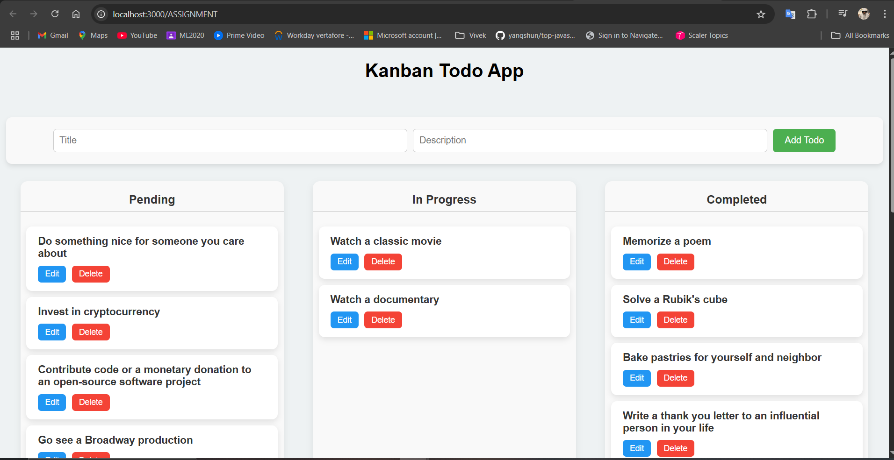
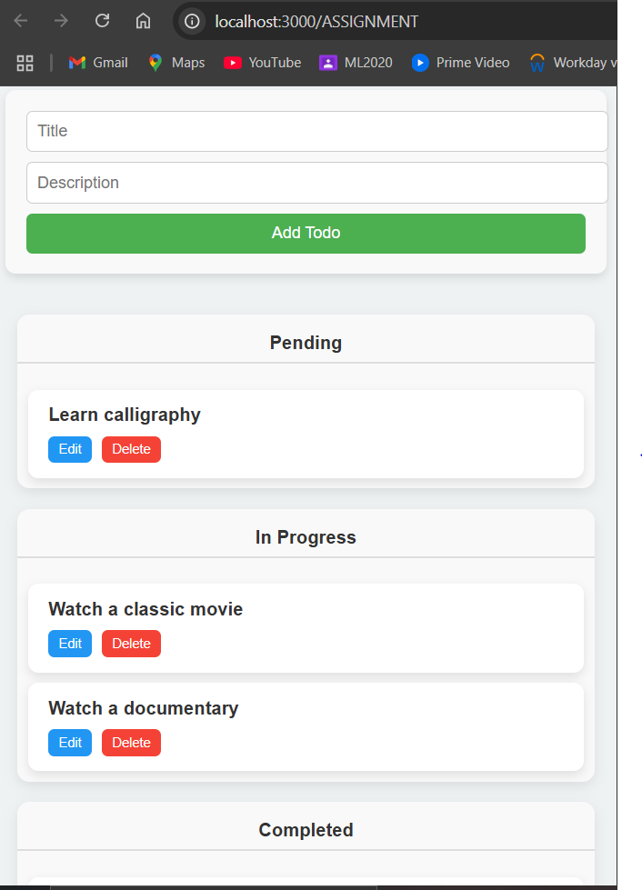

# Kanban Todo App

A responsive Kanban-style Todo Application built with React. Users can create, edit, delete, and drag todos across different status lanes — Pending, In Progress, and Completed.

## Features

- Add todos with title and description
- Edit existing todos
- Delete todos
- Drag and drop between status columns
- Fully responsive for mobile and desktop
- Data fetched from [DummyJSON API](https://dummyjson.com/todos)

## 📸 Screenshots

> Desktop view:
> 

> Mobile view:
> 

## Project Structure

/src
┣ /components
┃ ┣ KanbanBoard.js
┃ ┣ Lane.js
┃ ┣ TodoCard.js
┃ ┗ TodoForm.js
┣ /api
┃ ┗ fetchTodos.js
┣ App.js
┣ index.js
┗ index.css / styles.css

## Technologies Used

- React (with Hooks)
- React Router
- Axios
- HTML5 Drag and Drop API
- CSS (media queries for responsiveness)

## Setup Instructions

1. **Clone the repository:**

   ```bash
   git clone https://github.com/Rajdeepak24/ASSIGNMENT.git
   cd kanban-todo-app

   ```

2. **Install dependencies**

   npm install

3. **Run the development server**
   npm start
4. **Open in browser**
   Visit http://localhost:3000/ASSIGNMENT (or your configured basename)

5. **To See On Live**
   https://rajdeepak24.github.io/ASSIGNMENT/
